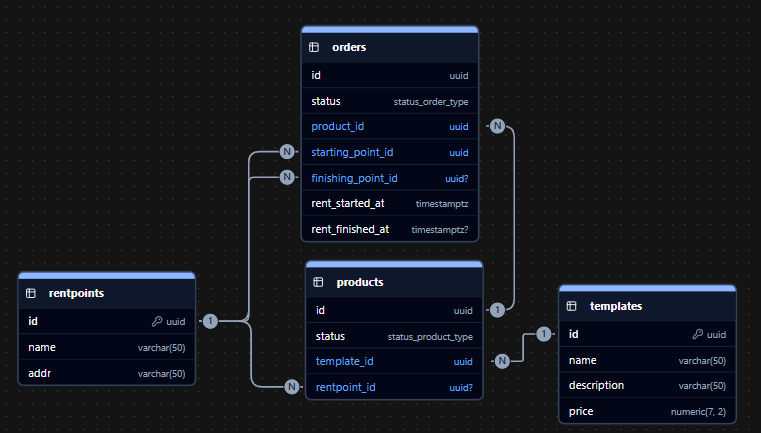

EasyRentGo — это API для системы аренды велосипедов с распределёнными точками проката.

## Сервис решает следующие задачи:

- управление каталогом шаблонов продуктов
- создание и хранение физических экземпляров продуктов
- управление точками проката
- создание заказов (начало аренды)
- завершение аренды

## Запуск

```
make rent_go
```

## Используемые инструменты

- Golang
- fiber - веб-фреймворк
- Docker
- pgx - библиотека для работы с PostgreSQL
- golang-migrate - настройка миграций
- go-playground/validator
- zerolog
- caarlos0/env - конфигурирование через переменные окружения
- Принципы Clean Architecture

## Структура БД



## Архитектура

Проект построен по принципам Clean Architecture:

- Controller layer - обработка HTTP-запросов
- Usecase layer- бизнес-логика
- Repository layer - работа с PostgreSQL
- Entity layer - описание бизнес сущностей
